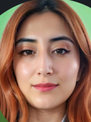

# PROGRAMACION-PARA-VIDEOJUEGOS---213027A_1704-
PROGRAMACIÓN PARA VIDEOJUEGOS - (213027A_1704)

# Laura Garcia

**Rol:** Desarrolladora - Probadora de Videojuegos

Vivo en Buenos Aires, Argentina. Estudio Ingeniería Multimedia y actualmente me dedico a ser Analista de Calidad de Software. También me apasiona el mundo del desarrollo de videojuegos y crear productos multimedia.
# Andres Riveros

**Rol:** Artista De personajes 

soy de Bogota colombia , me encantan los videojuegos y las historias que esto pueden contar,estudio ingenieria multimedia y actualmente soy nada mas estudiante. 
